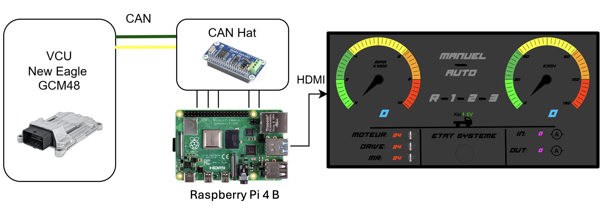

# EV Telemetry Dashboard (PyQt6)

Real-time dashboard for an electric pickup prototype, built with PyQt6.

This project visualizes **vehicle telemetry data transmitted over CAN bus**, including speed, RPM, temperatures, current, and system state, through a custom graphical dashboard.

---

## System Overview



The system operates as follows:

- The **Vehicle Control Unit (VCU)** processes real-time vehicle data 
- Data is transmitted over the **CAN bus**  
- A **Raspberry Pi 4B + CAN HAT** receives and decodes the CAN messages  
- The **PyQt6 dashboard** displays the data via HDMI in real time  

---

## What is Telemetry?

**Telemetry refers to real-time data transmitted from the vehicle’s control system to a monitoring interface.**

In this project, telemetry includes:

- Speed (km/h)  
- RPM  
- Motor temperature  
- Drive temperature  
- Current (input/output)  
- Gear selection (R, 1, 2, 3)  
- Drive mode (Manual / Auto)  
- System status indicators  

---

## Features

- Custom animated RPM and speed gauges  
- Real-time telemetry visualization from CAN bus  
- Temperature and current monitoring  
- Gear and drive mode display  
- System status indicators  
- PyQt6-based graphical interface  
- Designed for embedded automotive display systems  

---

## Technologies Used

- Python  
- PyQt6  
- python-can  
- Qt Designer (.ui)  
- Raspberry Pi (target platform)  

---

## How to Run

```bash
pip install -r requirements.txt
python main.py